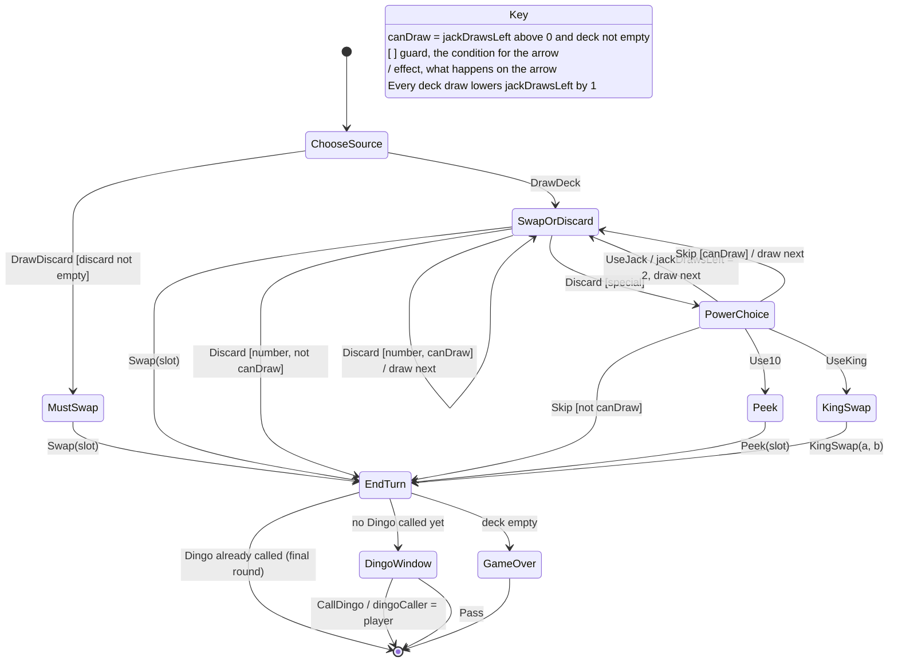

```mermaid
stateDiagram-v2
    direction TB

    %% Context: heldCard, jackDrawsLeft, dingoCaller, deck
    %% canDraw = jackDrawsLeft > 0 and deck not empty
    %% Every deck draw decrements jackDrawsLeft if it is above 0

    [*] --> ChooseSource

    ChooseSource --> SwapOrDiscard : DrawDeck
    ChooseSource --> MustSwap : DrawDiscard [discard not empty]

    MustSwap --> EndTurn : Swap(slot)

    SwapOrDiscard --> EndTurn : Swap(slot)
    SwapOrDiscard --> PowerChoice : Discard [special]
    SwapOrDiscard --> SwapOrDiscard : Discard [number, canDraw] / draw next
    SwapOrDiscard --> EndTurn : Discard [number, not canDraw]

    PowerChoice --> SwapOrDiscard : UseJack / jackDrawsLeft = 2, draw next
    PowerChoice --> Peek : Use10
    PowerChoice --> KingSwap : UseKing
    PowerChoice --> SwapOrDiscard : Skip [canDraw] / draw next
    PowerChoice --> EndTurn : Skip [not canDraw]

    Peek --> EndTurn : Peek(slot)
    KingSwap --> EndTurn : KingSwap(a, b)

    state EndTurn <<choice>>
    EndTurn --> GameOver : deck empty
    EndTurn --> DingoWindow : no Dingo called yet
    EndTurn --> [*] : Dingo already called (final round)

    DingoWindow --> [*] : CallDingo / dingoCaller = player
    DingoWindow --> [*] : Pass

    GameOver --> [*]


    state "Key" as Key
    Key : canDraw = jackDrawsLeft above 0 and deck not empty
    Key : [ ] guard, the condition for the arrow
    Key : / effect, what happens on the arrow
    Key : Every deck draw lowers jackDrawsLeft by 1
```